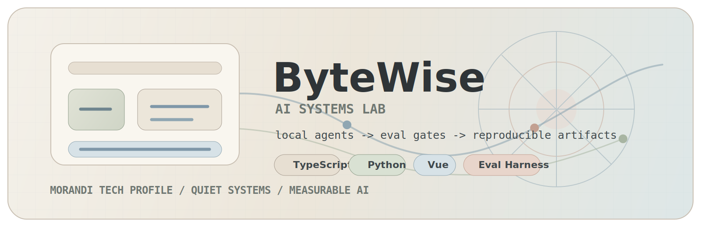
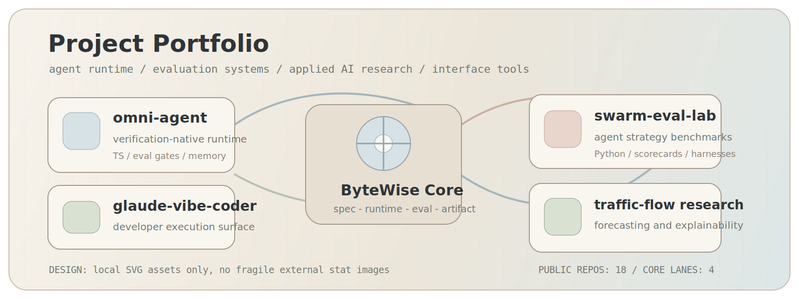
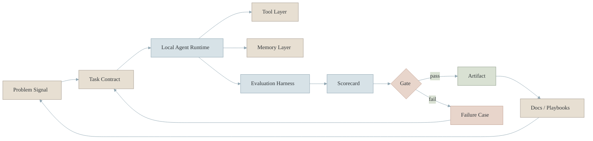
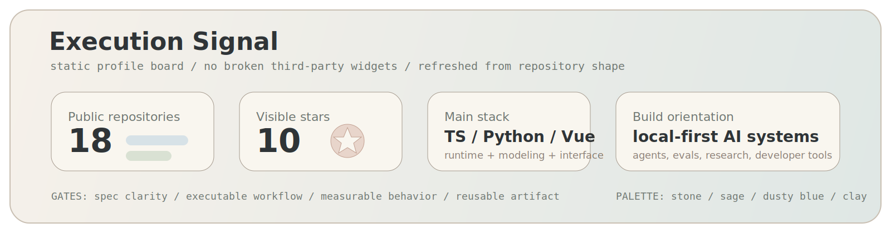

<div align="center">



<br>

<a href="#system-profile">System Profile</a>
&nbsp;|&nbsp;
<a href="#research-and-build-map">Research Map</a>
&nbsp;|&nbsp;
<a href="#project-portfolio">Project Portfolio</a>
&nbsp;|&nbsp;
<a href="#architecture-board">Architecture Board</a>
&nbsp;|&nbsp;
<a href="#execution-signal">Execution Signal</a>

</div>

---

## System Profile

```yaml
handle: ByteWise
account: 2830500285
mode: local-first AI systems engineering
palette: Morandi / low-saturation / calm technical
focus:
  - verification-native coding agents
  - evaluation harnesses and benchmark gates
  - reproducible applied AI research
  - TypeScript runtime, Python experiments, Vue interfaces
principle: "Build systems that can be run, inspected, measured, and improved."
```

<table>
  <tr>
    <td width="25%" valign="top">
      <strong>Agent Runtime</strong><br>
      Local coding-agent loops, memory, model profiles, subagents, approvals, and verifiable execution.
    </td>
    <td width="25%" valign="top">
      <strong>Evaluation Layer</strong><br>
      Benchmarks, scorecards, failure cases, harness design, and comparison workflows.
    </td>
    <td width="25%" valign="top">
      <strong>Research Engine</strong><br>
      Forecasting, modeling, reproducibility packages, and practical data experiments.
    </td>
    <td width="25%" valign="top">
      <strong>Product Surface</strong><br>
      Vue and TypeScript interfaces that make complex AI systems easier to operate.
    </td>
  </tr>
</table>

## Research And Build Map

| Track | Core signal | Representative repositories |
| --- | --- | --- |
| Local agent runtime | verification gates, memory, subagents, model profiles | [omni-agent](https://github.com/2830500285/omni-agent), [glaude-vibe-coder](https://github.com/2830500285/glaude-vibe-coder), [openclaw](https://github.com/2830500285/openclaw) |
| Evaluation systems | benchmark cases, harnesses, practical scoreboards | [swarm-eval-lab](https://github.com/2830500285/swarm-eval-lab), [agent-eval-learning](https://github.com/2830500285/agent-eval-learning), [Harness-Learning](https://github.com/2830500285/Harness-Learning) |
| Applied AI research | reproducible modeling, forecasting, explainability | [deep-learning-traffic-flow-forecasting-system](https://github.com/2830500285/deep-learning-traffic-flow-forecasting-system), [deep-learning-traffic-flow-research-experiments](https://github.com/2830500285/deep-learning-traffic-flow-research-experiments), [ai-driven-digital-comparative-advantage-trade-study](https://github.com/2830500285/ai-driven-digital-comparative-advantage-trade-study) |
| Developer tooling | skills, frameworks, workflow infrastructure | [skills](https://github.com/2830500285/skills), [agent-skills](https://github.com/2830500285/agent-skills), [vercel](https://github.com/2830500285/vercel), [next.js](https://github.com/2830500285/next.js) |
| Interface systems | desktop tools, maps, personal homepage | [2830500285.github.io](https://github.com/2830500285/2830500285.github.io), [sdust-qingdao-campus-navigation](https://github.com/2830500285/sdust-qingdao-campus-navigation) |

## Project Portfolio

<div align="center">



</div>

<table>
  <tr>
    <td width="33%" valign="top">
      <h3><a href="https://github.com/2830500285/omni-agent">omni-agent</a></h3>
      <p>Verification-native local coding-agent runtime with eval gates, memory, subagents, and model profiles.</p>
      <p><code>TypeScript</code> <code>agent-runtime</code> <code>eval-gates</code></p>
    </td>
    <td width="33%" valign="top">
      <h3><a href="https://github.com/2830500285/glaude-vibe-coder">glaude-vibe-coder</a></h3>
      <p>Vibe-coding workflow surface focused on faster local iteration and practical developer execution.</p>
      <p><code>TypeScript</code> <code>coding-agent</code> <code>workflow</code></p>
    </td>
    <td width="33%" valign="top">
      <h3><a href="https://github.com/2830500285/swarm-eval-lab">swarm-eval-lab</a></h3>
      <p>Python multi-agent evaluation lab for benchmarking single-agent and swarm strategies.</p>
      <p><code>Python</code> <code>benchmarks</code> <code>swarm</code></p>
    </td>
  </tr>
  <tr>
    <td width="33%" valign="top">
      <h3><a href="https://github.com/2830500285/agent-eval-learning">agent-eval-learning</a></h3>
      <p>Bilingual knowledge base for agent and LLM evaluation.</p>
      <p><code>evaluation</code> <code>handbook</code> <code>LLM</code></p>
    </td>
    <td width="33%" valign="top">
      <h3><a href="https://github.com/2830500285/MathModelAgent">MathModelAgent</a></h3>
      <p>Agent system for mathematical modeling and paper-ready analytical workflows.</p>
      <p><code>Python</code> <code>multi-agent</code> <code>modeling</code></p>
    </td>
    <td width="33%" valign="top">
      <h3><a href="https://github.com/2830500285/deep-learning-traffic-flow-forecasting-system">traffic-flow forecasting</a></h3>
      <p>Desktop forecasting application and experiments for LSTM and iTransformer traffic-flow modeling.</p>
      <p><code>Python</code> <code>forecasting</code> <code>explainability</code></p>
    </td>
  </tr>
</table>

## Architecture Board



## Execution Signal

<div align="center">



</div>

| Signal | Current shape | What I keep improving |
| --- | --- | --- |
| Repository system | 18 public repositories organized around agents, evals, research, and interfaces | clearer repo boundaries, better READMEs, more reproducible examples |
| Main languages | TypeScript for runtimes, Python for modeling and evals, Vue for product surfaces | stronger test gates, typed contracts, operator-grade docs |
| Agent direction | local-first coding agents with measurable execution loops | benchmark fixtures, replay logs, approvals, failure reports |
| Research direction | applied AI packages with data, models, and explainable outputs | dataset notes, comparison tables, clean experiment scripts |

## Operating Notes

```text
Spec first        -> define what success means
Runtime second    -> make the workflow executable
Evaluation third  -> measure behavior instead of trusting demos
Artifact last     -> ship something that can be reused
```

<table>
  <tr>
    <td width="50%" valign="top">
      <strong>What I build</strong><br>
      Agent runtimes, benchmark labs, applied AI research packages, developer tooling, and compact product interfaces.
    </td>
    <td width="50%" valign="top">
      <strong>What I optimize for</strong><br>
      Reproducibility, observability, verification gates, practical workflows, and systems that survive real use.
    </td>
  </tr>
</table>
