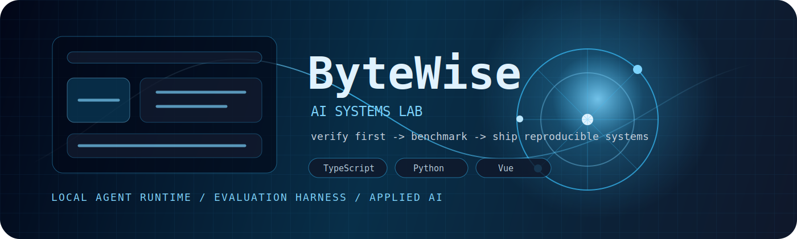
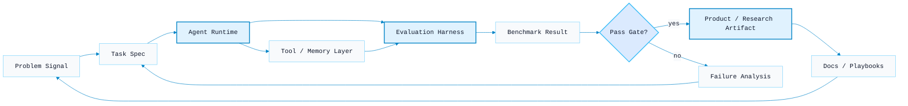

<div align="center">



<a href="https://git.io/typing-svg">
  
</a>

<br>


<a href="https://github.com/2830500285?tab=repositories"></a>
<a href="https://github.com/2830500285/omni-agent"></a>
<a href="https://github.com/2830500285/swarm-eval-lab"></a>

<p>
  <a href="#mission-control">Mission Control</a>
  |
  <a href="#systems-architecture">Systems Architecture</a>
  |
  <a href="#project-constellation">Project Constellation</a>
  |
  <a href="#metrics-deck">Metrics Deck</a>
  |
  <a href="#execution-roadmap">Execution Roadmap</a>
</p>

</div>

---

## Mission Control

```yaml
operator: ByteWise
domain: AI systems engineering
signature:
  - local coding agents with verification gates
  - benchmark-driven evaluation harnesses
  - reproducible applied AI research packages
  - TypeScript runtime, Python experiments, Vue interfaces
operating_rule: "If it cannot be measured, it is not finished."
```

<table>
  <tr>
    <td width="25%" valign="top">
      <strong>Runtime Core</strong><br>
      Build local coding-agent systems with memory, tool routing, model profiles, and observable execution loops.
    </td>
    <td width="25%" valign="top">
      <strong>Eval Layer</strong><br>
      Turn vague AI behavior into benchmark cases, scorecards, gates, and repeatable comparison workflows.
    </td>
    <td width="25%" valign="top">
      <strong>Research Engine</strong><br>
      Package forecasting, modeling, and data experiments as reproducible projects instead of one-off notebooks.
    </td>
    <td width="25%" valign="top">
      <strong>Product Surface</strong><br>
      Use clean TypeScript/Vue interfaces and documentation to make systems understandable and operable.
    </td>
  </tr>
</table>

## Systems Architecture



## Project Constellation

<div align="center">

<a href="https://github.com/2830500285/omni-agent">
  
</a>
<a href="https://github.com/2830500285/glaude-vibe-coder">
  
</a>

<a href="https://github.com/2830500285/swarm-eval-lab">
  
</a>
<a href="https://github.com/2830500285/deep-learning-traffic-flow-forecasting-system">
  
</a>

</div>

<table>
  <tr>
    <td width="33%" valign="top">
      <h3><a href="https://github.com/2830500285/agent-eval-learning">agent-eval-learning</a></h3>
      <p>Bilingual evaluation handbook for LLM and agent systems.</p>
      <p><code>evals</code> <code>playbooks</code> <code>agent systems</code></p>
    </td>
    <td width="33%" valign="top">
      <h3><a href="https://github.com/2830500285/Harness-Learning">Harness-Learning</a></h3>
      <p>Structured notes and examples for agent harness design.</p>
      <p><code>harness</code> <code>workflow</code> <code>docs</code></p>
    </td>
    <td width="33%" valign="top">
      <h3><a href="https://github.com/2830500285/ai-driven-digital-comparative-advantage-trade-study">trade-study</a></h3>
      <p>Reproducible applied AI package for digital comparative advantage research.</p>
      <p><code>research</code> <code>python</code> <code>reproducibility</code></p>
    </td>
  </tr>
</table>

## Intelligence Stack

<div align="center">


<br><br>


</div>

## Metrics Deck

<div align="center">


</div>

## Execution Roadmap

| Track | Current artifact | Next-level signal |
| --- | --- | --- |
| Agent runtime | [omni-agent](https://github.com/2830500285/omni-agent) | stronger local execution loop, more visible eval gates, operator-grade docs |
| Coding workflow | [glaude-vibe-coder](https://github.com/2830500285/glaude-vibe-coder) | sharper task pipeline, project templates, replayable examples |
| Evaluation systems | [swarm-eval-lab](https://github.com/2830500285/swarm-eval-lab) | richer benchmark fixtures, scorecards, comparative reports |
| Applied modeling | [traffic-flow forecasting system](https://github.com/2830500285/deep-learning-traffic-flow-forecasting-system) | better explainability, datasets, model comparison |
| Knowledge base | [agent-eval-learning](https://github.com/2830500285/agent-eval-learning) / [Harness-Learning](https://github.com/2830500285/Harness-Learning) | cleaner playbooks, diagrams, runnable examples |

## Activity Graph

<div align="center">


</div>
