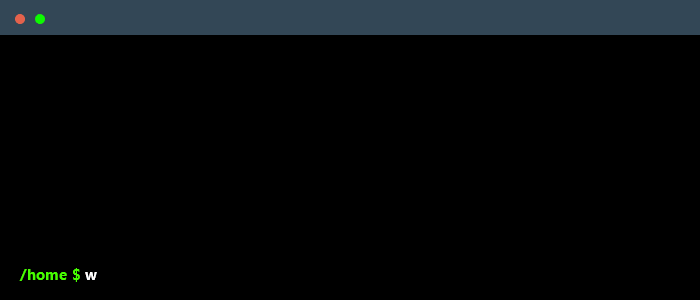
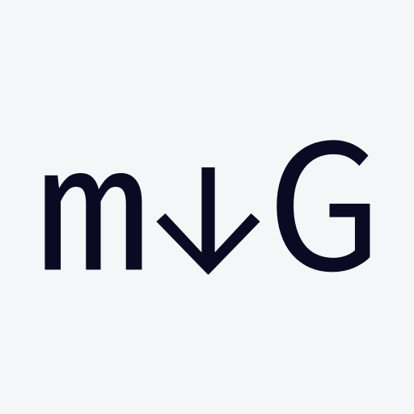
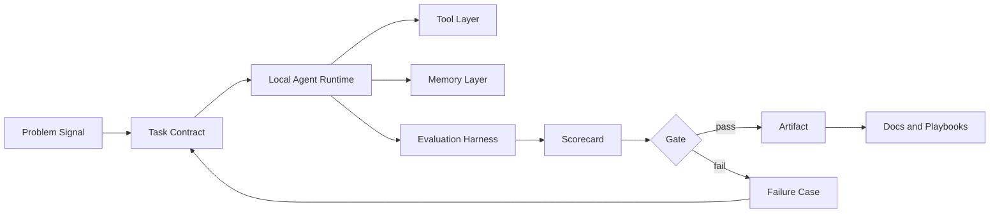
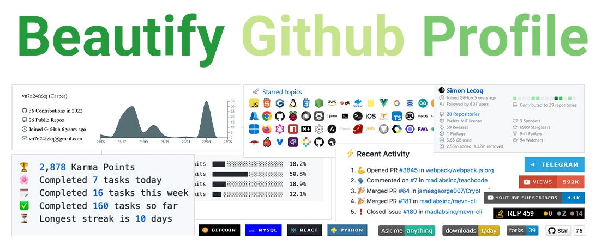

 

     

  

  <a href="#profile-core">Profile Core</a> &nbsp;|&nbsp; <a href="#source-dna">Source DNA</a> &nbsp;|&nbsp; <a href="#template-matrix">Template Matrix</a> &nbsp;|&nbsp; <a href="#trophy-board">Trophy Board</a> &nbsp;|&nbsp; <a href="#analytics-wall">Analytics Wall</a> &nbsp;|&nbsp; <a href="#project-portfolio">Project Portfolio</a> &nbsp;|&nbsp; <a href="#toolbox">Toolbox</a>

---

## Profile Core

<table>
  <tr>
    <td width="58%" valign="top">
      <h3>Hi, I am ByteWise.</h3>
      

        I build local-first AI agent systems, evaluation harnesses, and reproducible applied AI projects.
        The direction is simple: make AI workflows executable, inspectable, measurable, and easier to improve.
      

      <ul>
        <li><strong>Current work:</strong> verification-native local coding agents, memory, model profiles, subagents, and approval gates.</li>
        <li><strong>Current learning:</strong> agent evaluation, benchmark design, traffic-flow modeling, and practical reproducibility.</li>
        <li><strong>Ask me about:</strong> TypeScript runtimes, Python experiments, Vue interfaces, eval labs, and AI workflow design.</li>
        <li><strong>Project surface:</strong> <a href="https://github.com/2830500285?tab=repositories">all public repositories</a>.</li>
      </ul>
    </td>
    <td width="42%" valign="top">
      
    </td>
  </tr>
</table>

   

## Source DNA

This profile is rebuilt from zero around the five requested projects. I kept their original roles instead of only imitating their appearance.

| Source project | Preserved profile elements |
| --- | --- |
| [rzashakeri/beautify-github-profile](https://github.com/rzashakeri/beautify-github-profile) | table of contents, badge catalogue, widget catalogue, icon/generator/toolbox pattern, local original assets |
| [ryo-ma/github-profile-trophy](https://github.com/ryo-ma/github-profile-trophy) | live trophy board, rank vocabulary, theme/options reference, service attribution |
| [durgeshsamariya/awesome-github-profile-readme-templates](https://github.com/durgeshsamariya/awesome-github-profile-readme-templates) | about-me blocks, tech stack wall, analytics area, project table, connect section, quote/widget ideas |
| [abhisheknaiidu/awesome-github-profile-readme](https://github.com/abhisheknaiidu/awesome-github-profile-readme) | category index, dynamic realtime mode, code mode, badges, icons, tools/articles/tutorial style |
| [rahuldkjain/github-profile-readme-generator](https://github.com/rahuldkjain/github-profile-readme-generator) | generated README structure, visitor counter, social icon model, skills icons, stats/streak/trophy sections |

<table>
  <tr>
    <td align="center" width="33%">
      
       
      trophy service
    </td>
    <td align="center" width="33%">
      
       
      generator structure
    </td>
    <td align="center" width="33%">
      
       
      social icon set
    </td>
  </tr>
</table>

## Generator Blocks

<table>
  <tr>
    <td width="50%" valign="top">
      <h3>Current Work</h3>
      
<a href="https://github.com/2830500285/omni-agent"><strong>omni-agent</strong></a> is the main local coding-agent runtime experiment: eval gates, memory, subagents, model profiles, and measurable execution.

      
<a href="https://github.com/2830500285/glaude-vibe-coder"><strong>glaude-vibe-coder</strong></a> explores fast developer workflow surfaces for local coding loops.

    </td>
    <td width="50%" valign="top">
      <h3>Current Research</h3>
      
<a href="https://github.com/2830500285/swarm-eval-lab"><strong>swarm-eval-lab</strong></a>, <a href="https://github.com/2830500285/agent-eval-learning"><strong>agent-eval-learning</strong></a>, and <a href="https://github.com/2830500285/Harness-Learning"><strong>Harness-Learning</strong></a> form the evaluation and harness track.

      
Traffic-flow forecasting and trade-study repos keep the applied AI side reproducible.

    </td>
  </tr>
</table>

<h3 align="left">Connect with me</h3>

  

## Template Matrix

The templates from the two awesome-profile collections usually combine a strong intro, compact badges, project cards, dynamic widgets, and a clear contact area. This profile keeps that full pattern.

| Mode from the template collections | Implementation here |
| --- | --- |
| GitHub Actions / Dynamic Realtime | activity graph, summary cards, profile views, comments ready for future workflow inserts |
| Code Mode | runtime/eval/research stack, repo table, language badges, skill icons |
| A Little Bit of Everything | trophies, streak, summary cards, quote, project portfolio, toolbox |
| Descriptive | profile core, work/research split, repository map |
| Badges and Icons | shields badge wall, generator social icon, skillicons stack |
| Minimalistic fallback | all sections are readable even if dynamic image services fail |

  

## Trophy Board

  

| Trophy option from the original project | Value used here |
| --- | --- |
| `username` | `2830500285` |
| `theme` | `flat` |
| `column` | `8` |
| `margin-w` / `margin-h` | `10` / `10` |
| `no-bg` | `true` |

<strong>Trophy rank vocabulary kept from the source project</strong>

`SSS`, `SS`, `S`, `AAA`, `AA`, `A`, `B`, `C`, `UNKNOWN`, and `SECRET` are the original rank families used by `github-profile-trophy`.

## Analytics Wall

 

  

  

  

  

  

<!-- BLOG-POST-LIST:START -->
<!-- BLOG-POST-LIST:END -->

<!--START_SECTION:activity-->
<!--END_SECTION:activity-->

## Project Portfolio

<table>
  <thead align="center">
    <tr>
      <td><strong>Project</strong></td>
      <td><strong>Track</strong></td>
      <td><strong>Signal</strong></td>
      <td><strong>Stars</strong></td>
      <td><strong>Forks</strong></td>
    </tr>
  </thead>
  <tbody>
    <tr>
      <td><a href="https://github.com/2830500285/omni-agent"><strong>omni-agent</strong></a></td>
      <td>local coding agent</td>
      <td>eval gates, memory, subagents, model profiles</td>
      <td></td>
      <td></td>
    </tr>
    <tr>
      <td><a href="https://github.com/2830500285/glaude-vibe-coder"><strong>glaude-vibe-coder</strong></a></td>
      <td>developer workflow</td>
      <td>vibe-coding loop, local iteration, TypeScript surface</td>
      <td></td>
      <td></td>
    </tr>
    <tr>
      <td><a href="https://github.com/2830500285/swarm-eval-lab"><strong>swarm-eval-lab</strong></a></td>
      <td>agent evaluation</td>
      <td>single-agent and swarm benchmark lab</td>
      <td></td>
      <td></td>
    </tr>
    <tr>
      <td><a href="https://github.com/2830500285/agent-eval-learning"><strong>agent-eval-learning</strong></a></td>
      <td>evaluation handbook</td>
      <td>bilingual agent and LLM evaluation knowledge base</td>
      <td></td>
      <td></td>
    </tr>
    <tr>
      <td><a href="https://github.com/2830500285/Harness-Learning"><strong>Harness-Learning</strong></a></td>
      <td>harness notes</td>
      <td>practical test harness and workflow material</td>
      <td></td>
      <td></td>
    </tr>
    <tr>
      <td><a href="https://github.com/2830500285/deep-learning-traffic-flow-forecasting-system"><strong>traffic-flow forecasting</strong></a></td>
      <td>applied AI</td>
      <td>LSTM and iTransformer desktop forecasting system</td>
      <td></td>
      <td></td>
    </tr>
  </tbody>
</table>

## Build Map

## Toolbox

<strong>Badges retained from the beautify profile catalogue</strong>

| Badge source | Use in this profile |
| --- | --- |
| [shields.io](https://shields.io/) | profile counters, project badges, stack labels |
| [Naereen/badges](https://github.com/Naereen/badges) | classic Markdown badge idea bank |
| [Ileriayo/markdown-badges](https://github.com/Ileriayo/markdown-badges) | language and platform badge catalogue |
| [dwyl/hits](https://github.com/dwyl/hits) | hit counter pattern |
| [antonkomarev/github-profile-views-counter](https://github.com/antonkomarev/github-profile-views-counter) | profile views concept via Komarev badge |
| [Badges4-README.md-Profile](https://github.com/alexandresanlim/Badges4-README.md-Profile) | profile badge wall pattern |
| [BraveUX/for-the-badge](https://github.com/BraveUX/for-the-badge) | large visual badge style |

<strong>Widgets retained from the profile README ecosystem</strong>

| Widget | Live usage |
| --- | --- |
| [github-profile-trophy](https://github.com/ryo-ma/github-profile-trophy) | trophy board |
| [github-readme-stats](https://github.com/anuraghazra/github-readme-stats) | stats and language cards through a working mirror |
| [github-readme-streak-stats](https://github.com/DenverCoder1/github-readme-streak-stats) | contribution streak |
| [github-readme-activity-graph](https://github.com/Ashutosh00710/github-readme-activity-graph) | contribution activity graph |
| [github-profile-summary-cards](https://github.com/vn7n24fzkq/github-profile-summary-cards) | profile summary cards |
| [readme-typing-svg](https://github.com/DenverCoder1/readme-typing-svg) | animated profile line |
| [capsule-render](https://github.com/kyechan99/capsule-render) | header banner |
| [quotes-github-readme](https://github.com/PiyushSuthar/github-readme-quotes) | random developer quote |

<strong>Awesome profile categories retained as design modes</strong>

`GitHub Actions`, `Game Mode`, `Code Mode`, `Dynamic Realtime`, `A Little Bit of Everything`, `Descriptive`,
`Simple but Innovative`, `Typing Mode`, `Minimalistic`, `GIFS`, `Just Images`, `Badges`, `Fancy Fonts`, `Icons`, and `Retro`.

<strong>Generator features retained as checklist</strong>

- Uniform social icons
- Uniform dev icons
- Visitors counter badge
- GitHub profile trophy
- GitHub stats card
- GitHub top skills / language card
- GitHub streak stats
- Dynamic blog and activity placeholders
- Markdown preview friendly HTML blocks

<strong>Local reference assets copied from the downloaded projects</strong>

  

`beautify-terminal.gif`, `beautify-cover.jpg`, `trophy-logo.png`, `gprg-mdg.png`, and `github.svg` are kept locally so the profile does not depend only on remote raw asset paths.

## Credits

This README intentionally keeps visible attribution to the five reference projects:

<a href="https://github.com/rzashakeri/beautify-github-profile">beautify-github-profile</a> &nbsp;|&nbsp; <a href="https://github.com/ryo-ma/github-profile-trophy">github-profile-trophy</a> &nbsp;|&nbsp; <a href="https://github.com/durgeshsamariya/awesome-github-profile-readme-templates">awesome templates</a> &nbsp;|&nbsp; <a href="https://github.com/abhisheknaiidu/awesome-github-profile-readme">awesome profile README</a> &nbsp;|&nbsp; <a href="https://github.com/rahuldkjain/github-profile-readme-generator">profile README generator</a>

